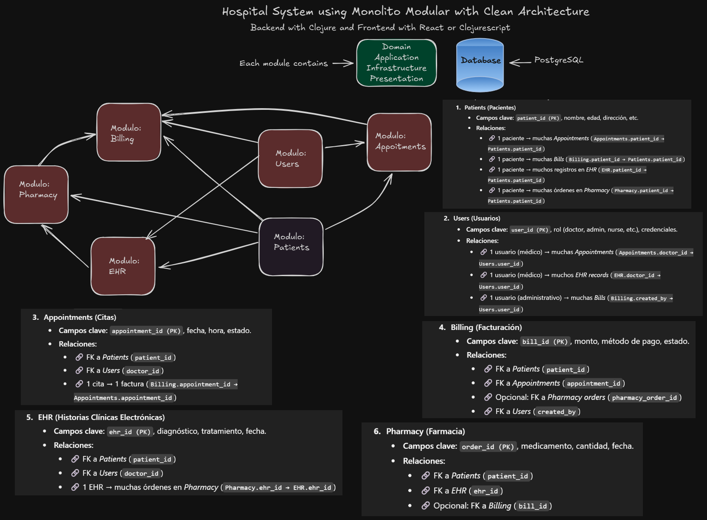
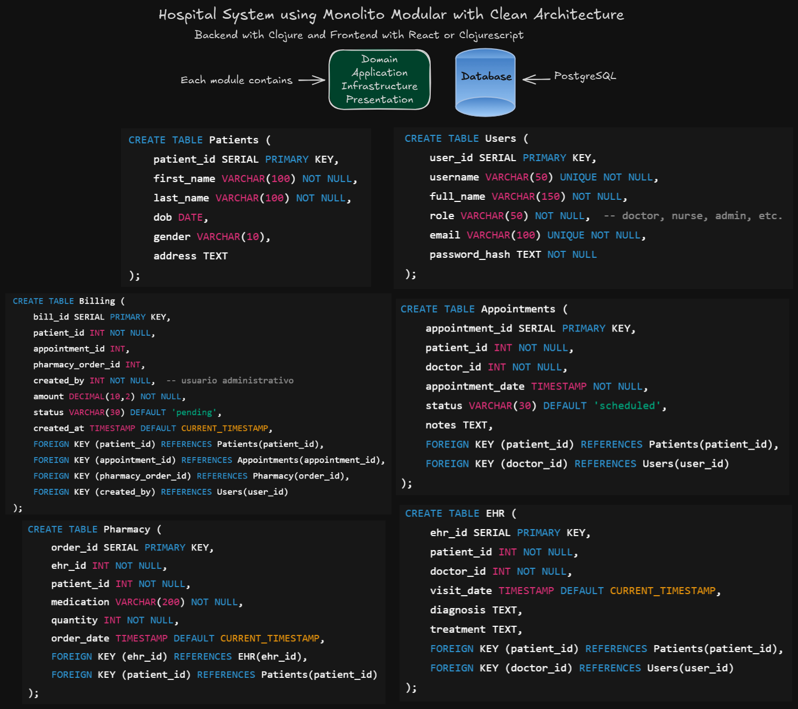

# Hospital System

  

## Description

## Monolito modular + Clean Architecture.
## https://chatgpt.com/share/68d5a84c-b8f8-8009-8805-1befe71efb94
## https://chatgpt.com/share/68d5a916-6e6c-8009-b94a-cebfb9821792
## https://chatgpt.com/share/68d5c115-0a94-8009-99f9-8dd6a3f21777
## https://chatgpt.com/share/68d5c115-0a94-8009-99f9-8dd6a3f21777

# Diagrams:

## Microservices:
- Los microservicios son una respuesta a un problema organizacional, no técnico. Si no estás seguro de por qué querrías usar microservicios, no los uses.
- Debería considerar los microservicios cuando sus problemas de coordinación humana se agraven tanto que resulte interesante sustituirlos por problemas de sistemas distribuidos (que son complejos y añadirán importantes obstáculos técnicos). Por lo tanto, la elección de microservicios depende principalmente del lenguaje.